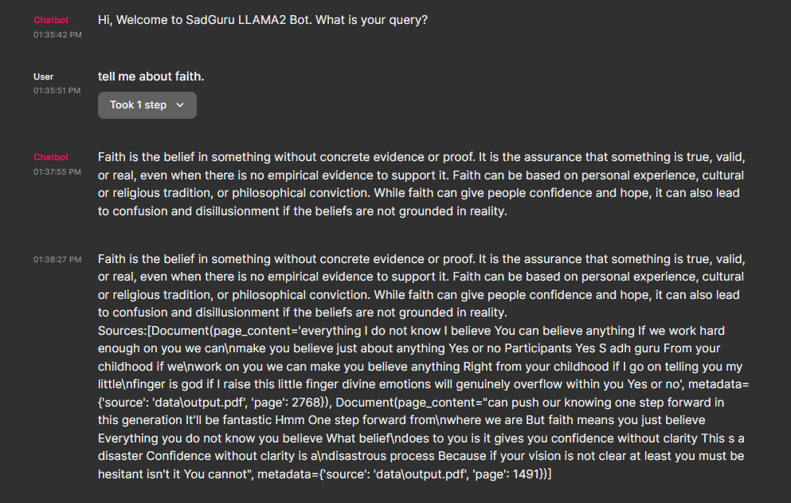

# Sadguru LLAMA2 Bot

The Sadguru LLAMA2 Bot is a conversational AI model trained on transcripts from Sadguru's YouTube channel videos spanning over 11 years. It leverages the power of ChainLit, a Python library for building conversational AI bots, to provide answers and insights to users' queries based on the vast knowledge and wisdom shared by Sadguru through his videos.
Features

Rich Knowledge Base: The bot has been trained on a wide range of topics covered in Sadguru's YouTube videos, making it a valuable resource for users seeking information, advice, and insights.

11 Years of Wisdom: The bot has access to knowledge accumulated over more than a decade, providing answers that are rooted in a deep understanding of various subjects.

Prompt-Driven Conversations: The bot interacts with users using a customizable prompt template that encourages it to provide helpful and relevant answers to users' questions.

----

### User Note : Please 1st Download and place the LLAMA 2B model into native directory before running the program.

**Download LLAMA 2b here :** https://huggingface.co/TheBloke/Llama-2-7B-Chat-GGML/blob/main/llama-2-7b-chat.ggmlv3.q8_0.bin

(size of model is 6gbs so not possible to push if not in repo (may have automatically been rejected by repo management system)

0.) Dowload the said model

1.) Run Ingest.py

2.) later run model.py

3.) Run command in terminal : chainlit run model.py -w

4.) User window automatically pops up as see in readme,md

------

## Usage

Start the Bot: The Sadguru LLAMA2 Bot can be started using the provided ChainLit script. It initializes the bot's capabilities and prepares it to respond to user queries.

Ask Questions: Users can engage with the bot by asking questions or seeking insights on various topics. Simply type your question in the chat window.

Receive Insights: The bot will respond with insights, answers, and information based on the knowledge it has acquired from Sadguru's YouTube videos.

## Customization

Prompt Template: The bot's responses are guided by a prompt template that can be customized to enhance the user experience and the nature of the bot's responses.

### Installation

Clone the repository to your local machine:
```
git clone https://github.com/your-username/sadguru-llama2-bot.git
```
### Install the required dependencies:
```
pip install chainlit youtube-transcript-api
```
### Run the ChainLit script to start the Sadguru LLAMA2 Bot:
```
python sadguru_llama2_bot.py
```
### Demonstration


### Disclaimer
```
The Sadguru LLAMA2 Bot is an AI-powered conversational model and its responses are based on the transcripts of Sadguru's YouTube videos. It may not always provide accurate or up-to-date information. Always verify information from reliable sources for critical matters.
```

#### Contributions

Contributions to the Sadguru LLAMA2 Bot project are welcome! If you have ideas for improving the bot's capabilities, enhancing its responses, or adding new features, feel free to submit pull requests.